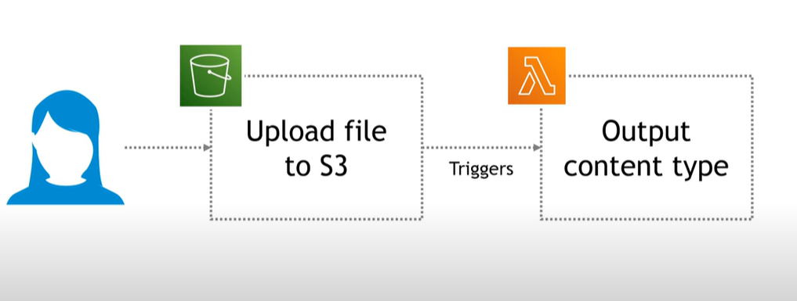

# 📁 S3 Lambda File Type Detector

This AWS project demonstrates how to automatically detect and log the file type (MIME type) of any object uploaded to an S3 bucket using a Lambda function triggered by an S3 event.

Whenever a file is uploaded to the bucket, a Lambda function is triggered. It retrieves the uploaded file’s metadata and logs its MIME type and file name.

---

## 🖼️ Architecture Diagram

---

## 🚀 Step-by-Step Guide

### 🪣 1. Create an S3 Bucket

Create a new S3 bucket that will store uploaded files and trigger the Lambda function.

📷 *Screenshot* 

---

### ⚙️ 2. Create the Lambda Function

1. Go to AWS Lambda and create a new function (Python 3.13).
2. Paste the code from `lambda_function.py`.
3. Add a trigger connected to your S3 bucket and select "All object create events".

📷 *Screenshot*  

---
### 🔍 3. execution section
Once a file is uploaded:

The Lambda function is automatically triggered by the S3 event. You can verify that the function was triggered by checking the logs in Amazon CloudWatch.

📷 *Screenshot* 

📷 *Screenshot*

### 4.✅ Conclusion
This project is a simple demonstration of how AWS S3 and Lambda can work together to automate file analysis. It shows how easy it is to:

-React to file uploads in real-time

-Run serverless code with no infrastructure setup

-View logs directly in CloudWatch
